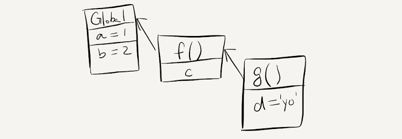

## JavaScript 进阶 - 第1天

> 学习作用域、变量提升、闭包等语言特征，加深对 JavaScript 的理解，掌握变量赋值、函数声明的简洁语法，降低代码的冗余度。

- 理解作用域对程序执行的影响
- 能够分析程序执行的作用域范围
- 理解闭包本质，利用闭包创建隔离作用域
- 了解什么变量提升及函数提升
- 掌握箭头函数、解析剩余参数等简洁语法

### 一、作用域

> 了解作用域对程序执行的影响及作用域链的查找机制，使用闭包函数创建隔离作用域避免全局变量污染。

作用域（scope）规定了变量能够被访问的“范围”，离开了这个“范围”变量便不能被访问，作用域分为全局作用域和局部作用域。

#### 1.1 局部作用域

局部作用域分为函数作用域和块作用域。

##### 函数作用域

在函数内部声明的变量只能在函数内部被访问，外部无法直接访问。

```html
<script>
  // 声明 counter 函数
  function counter(x, y) {
    // 函数内部声明的变量
    let s = x + y;
    console.log(s); // 18
  }

  // 设用 counter 函数
  counter(10, 8);

  // 访问变量 s
  console.log(s); // 报错
</script>
```

总结：

1. 函数内部声明的变量，在函数外部无法被访问
2. 函数的参数也是函数内部的局部变量
3. 不同函数内部声明的变量无法互相访问
4. 函数执行完毕后，函数内部的变量实际被清空了

##### 块作用域

在 JavaScript 中使用 `{}` 包裹的代码称为代码块，代码块内部声明的变量外部将【有可能】无法被访问。

```html
<script>
  {
    // age 只能在该代码块中被访问
    let age = 18;
    console.log(age); // 正常
  }
  
  // 超出了 age 的作用域
  console.log(age); // 报错
  
  let flag = true;
  if(flag) {
    // str 只能在该代码块中被访问
    let str = 'hello world!';
    console.log(str); // 正常
  }
  
  // 超出了 age 的作用域
  console.log(str); // 报错
  
  for(let t = 1; t <= 6; t++) {
    // t 只能在该代码块中被访问
    console.log(t); // 正常
  }
  
  // 超出了 t 的作用域
  console.log(t); // 报错
</script>
```

JavaScript 中除了变量外还有常量，常量与变量本质的区别是【常量必须要有值且不允许被重新赋值】，常量值为对象时其属性和方法允许重新赋值。

```html
<script>
  // 必须要有值
  const version = '1.0.0';

  // 不能重新赋值
  // version = '1.0.1';

  // 常量值为对象类型
  const user = {
    name: '小明',
    age: 18
  }

  // 不能重新赋值
  user = {};

  // 属性和方法允许被修改
  user.name = '小小明';
  user.gender = '男';
</script>
```

总结：

1. `let` 声明的变量会产生块作用域，`var` 不会产生块作用域
2. `const` 声明的常量也会产生块作用域
3. 不同代码块之间的变量无法互相访问
4. 推荐使用 `let` 或 `const`

注：开发中 `let` 和 `const` 经常不加区分的使用，如果担心某个值会不小被修改时，则只能使用 `const` 声明成常量。

- | 关键字 | 块级作用域 | 变量提升 | 初始值 | 更改值 | 通过window调用 |
  | ------ | :--------: | :------: | :----: | :----: | :------------: |
  | let    |     √      |    ×√    |   -    |  Yes   |       No       |
  | const  |     √      |    ×√    |  Yes   |   No   |       No       |
  | var    |     ×      |    √     |   -    |  Yes   |      Yes       |

### 

#### 1.2 全局作用域

`<script>` 标签和 `.js` 文件的【最外层】就是所谓的全局作用域，在此声明的变量在函数内部也可以被访问。

```html
<script>
  // 此处是全局
  
  function sayHi() {
    // 此处为局部
  }

  // 此处为全局
</script>
```

全局作用域中声明的变量，任何其它作用域都可以被访问，如下代码所示：

```html
<script>
    // 全局变量 name
    let name = '小明';
  
  	// 函数作用域中访问全局
    function sayHi() {
      // 此处为局部
      console.log('你好' + name);
    }

    // 全局变量 flag 和 x
    let flag = true;
    let x = 10;
  
  	// 块作用域中访问全局
    if(flag) {
      let y = 5;
      console.log(x + y); // x 是全局的
    }
</script>
```

总结：

1. 为 `window` 对象动态添加的属性默认也是全局的，不推荐！
2. 函数中未使用任何关键字声明的变量为全局变量，不推荐！！！
3. 尽可能少的声明全局变量，防止全局变量被污染

JavaScript 中的作用域是程序被执行时的底层机制，了解这一机制有助于规范代码书写习惯，避免因作用域导致的语法错误。

#### 1.3 作用域链

在解释什么是作用域链前先来看一段代码：

```html
<script>
  // 全局作用域
  let a = 1;
  let b = 2;
	
  // 局部作用域
  function f() {
    let c;
    // 局部作用域
    function g() {
      let d = 'yo';
    }
  }
</script>
```

函数内部允许创建新的函数，`f` 函数内部创建的新函数 `g`，会产生新的函数作用域，由此可知作用域产生了嵌套的关系。

如下图所示，父子关系的作用域关联在一起形成了链状的结构，作用域链的名字也由此而来。



作用域链本质上是底层的变量查找机制，在函数被执行时，会优先查找当前函数作用域中查找变量，如果当前作用域查找不到则会依次逐级查找父级作用域直到全局作用域，如下代码所示：

```html
<script>
  // 全局作用域
  let a = 1;
  let b = 2;

  // 局部作用域
  function f() {
    let c;
    // let a = 10;
    console.log(a); // 1 或 10
    console.log(d); // 报错
    
    // 局部作用域
    function g() {
      let d = 'yo';
      // let b = 20;
      console.log(b); // 2 或 20
    }
    
    // 调用 g 函数
    g()
  }

  console.log(c); // 报错
  console.log(d); // 报错
  
  f();
</script>
```

总结：

1. 嵌套关系的作用域串联起来形成了作用域链
2. 相同作用域链中按着从小到大的规则查找变量
3. 子作用域能够访问父作用域，父级作用域无法访问子级作用域（就近原则）

#### 1.4 闭包

闭包是一种比较特殊和函数，使用闭包能够访问函数作用域中的变量。从代码形式上看闭包是一个做为返回值的函数，如下代码所示：

```html
<script>
  function foo() {
    let i = 0;

    // 函数内部分函数
    function bar() {
			console.log(++i);
    }

    // 将函数做为返回值
    return bar;
  }
  
  // fn 即为闭包函数
  let fn = foo();
  
  fn(); // 1
</script>
```

总结：

闭包：一个作用域有权访问另外一个作用域的局部变量，

好处：可以把一个变量使用范围延伸

1. 闭包本质仍是函数，只不是从函数内部返回的
2. 闭包能够创建外部可访问的隔离作用域，避免全局变量污染
3. 过度使用闭包可能造成内存泄漏

注：回调函数也能访问函数内部的局部变量。

#### 1.5 变量提升

变量提升是 JavaScript 中比较“奇怪”的现象，它允许在变量声明之前即被访问，

```html
<script>
  // 访问变量 str
  console.log(str + 'world!');

  // 声明变量 str
  var str = 'hello ';
</script>

let和var都有提升，但是let定义的变量没有赋值之前是不可以使用、var可以使用是undefined
```

总结：

1. 变量在未声明即被访问时会报语法错误
2. 变量在声明之前即被访问，变量的值为 `undefined`
3. `let` 声明的变量不存在变量提升，推荐使用 `let`【也有人认为具有提升但是不赋值不能使用】
4. 变量提升出现在相同作用域当中
5. 实际开发中推荐先声明再访问变量

注：关于变量提升的原理分析会涉及较为复杂的词法分析等知识，而开发中使用 `let` 可以轻松规避变量的提升，因此在此不做过多的探讨，有兴趣可[查阅资料](https://segmentfault.com/a/1190000013915935)。

### 二、函数

> 知道函数参数默认值、动态参数、剩余参数的使用细节，提升函数应用的灵活度，知道箭头函数的语法及与普通函数的差异。

#### 2.1 函数提升

函数提升与变量提升比较类似，是指函数在声明之前即可被调用。

```html
<script>
  // 调用函数
  foo();

  // 声明函数
  function foo() {
    console.log('声明之前即被调用...');
  }

  // 不存在提升现象
  bar();
  var bar = function () {
    console.log('函数表达式不存在提升现象...');
  }
</script>
```

总结：

1. 函数提升能够使函数的声明调用更灵活
2. 函数表达式不存在提升的现象
3. 函数提升出现在相同作用域当中

#### 2.2 参数

函数参数的使用细节，能够提升函数应用的灵活度。

##### 默认值

```html
<script>
  // 设置参数默认值
  function sayHi(name="小明", age=18) {
    document.write(`<p>大家好，我叫${name}，我今年${age}岁了。</p>`);
  }
  // 调用函数
  sayHi();
  sayHi('小红');
  sayHi('小刚', 21);
</script>
```

总结：

1. 声明函数时为形参赋值即为参数的默认值
2. 如果参数未自定义默认值时，参数的默认值为 `undefined`
3. 调用函数时没有传入对应实参时，参数的默认值被当做实参传入

##### 动态参数

`arguments` 是函数内部内置的伪数组变量，它包含了调用函数时传入的所有实参。

```html
<script>
  // 求生函数，计算所有参数的和
  function sum() {
    // console.log(arguments);
    let s = 0;
    for(let i = 0; i < arguments.length; i++) {
      s += arguments[i];
    }
    console.log(s);
  }

  // 调用求和函数
  sum(5, 10); // 两个参数
  sum(1, 2, 4); // 两个参数
</script>
```

总结：

1. `arguments` 是一个伪数组
2. `arguments` 的作用是动态获取函数的实参

##### 剩余参数

```html
<script>
  function config(baseURL, ...other) {
    console.log(baseURL);
    // other 是真数组，动态获取实参
    console.log(other);
  }

  // 调用函数
  config('http://baidu.com', 'get', 'json');
</script>
```

总结：

1. `...` 是语法符号，置于最末函数形参之前，用于获取多余的实参
2. 借助 `...` 获取的剩余实参

#### 2.3 箭头函数

箭头函数是一种声明函数的简洁语法，它与普通函数并无本质的区别，差异性更多体现在语法格式上。

```html
<script>
  // 箭头函数
  let foo = () => {
    console.log('^_^ 长相奇怪的函数...');
  }
  // 调用函数
  foo();
  
  // 更简洁的语法
  let form = document.querySelector('form');
  form.addEventListener('click', ev => ev.preventDefault());
</script>
```

总结：

1. 箭头函数属于表达式函数，因此不存在函数提升
2. 箭头函数只有一个参数时可以省略圆括号 `()`
3. 箭头函数函数体只有一行代码时可以省略花括号 `{}`，并自动做为返回值被返回
4. 箭头函数中没有 `arguments`，只能使用 `...` 动态获取实参
5. 涉及到this的使用，不建议用箭头函数

### 三、解构赋值

> 知道解构的语法及分类，使用解构简洁语法快速为变量赋值。

解构赋值是一种快速为变量赋值的简洁语法，本质上仍然是为变量赋值，分为数组解构、对象解构两大类型。

#### 3.1 数组解构

数组解构是将数组的单元值快速批量赋值给一系列变量的简洁语法，如下代码所示：

```html
<script>
  // 普通的数组
  let arr = [1, 2, 3];
  // 批量声明变量 a b c 
  // 同时将数组单元值 1 2 3 依次赋值给变量 a b c
  let [a, b, c] = arr;
  console.log(a); // 1
  console.log(b); // 2
  console.log(c); // 3
</script>
```

总结：

1. 赋值运算符 `=` 左侧的 `[]` 用于批量声明变量，右侧数组的单元值将被赋值给左侧的变量
2. 变量的顺序对应数组单元值的位置依次进行赋值操作
3. 变量的数量大于单元值数量时，多余的变量将被赋值为  `undefined`
4. 变量的数量小于单元值数量时，可以通过 `...` 获取剩余单元值，但只能置于最末位
5. 允许初始化变量的默认值，且只有单元值为 `undefined` 时默认值才会生效

注：支持多维解构赋值，比较复杂后续有应用需求时再进一步分析

#### 3.2 对象解构

对象解构是将对象属性和方法快速批量赋值给一系列变量的简洁语法，如下代码所示：

```html
<script>
  // 普通对象
  let user = {
    name: '小明',
    age: 18
  };

  // 批量声明变量 name age
  // 同时将数组单元值 1 2 3 依次赋值给变量 a b c
  let {name, age} = user;

  console.log(name); // 小明
  console.log(age); // 18
</script>
```

总结：

1. 赋值运算符 `=` 左侧的 `{}` 用于批量声明变量，右侧对象的属性值将被赋值给左侧的变量
2. 对象属性的值将被赋值给与属性名相同的变量
3. 对象中找不到与变量名一致的属性时变量值为 `undefined`
4. 允许初始化变量的默认值，属性不存在或单元值为 `undefined` 时默认值才会生效

注：支持多维解构赋值，比较复杂后续有应用需求时再进一步分析

